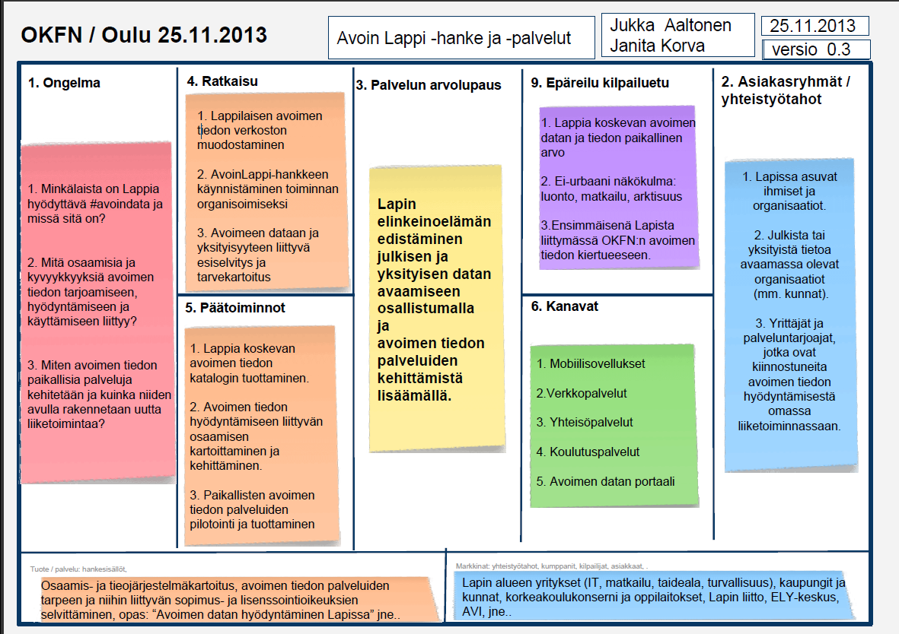

# AvoinLappi-hankeidea

## Pääkohdat (kuva)

## Pääkohdat (liiketoimintapohja)

### 1. Ongelma
### 2. Asiakasryhmät ja yhteistyötahot
### 3. Arvolupaus
### 4. Ratkaisu
### 5. Ydintoiminnot
### 6. Kanavat
### 7. Tuote, palvelu, hankesisältö
### 8. Markkina, yhteistyötahot, kumappnit, kilpailijat, asiakkaat
### 9. Epäreilu kilpailuetu

